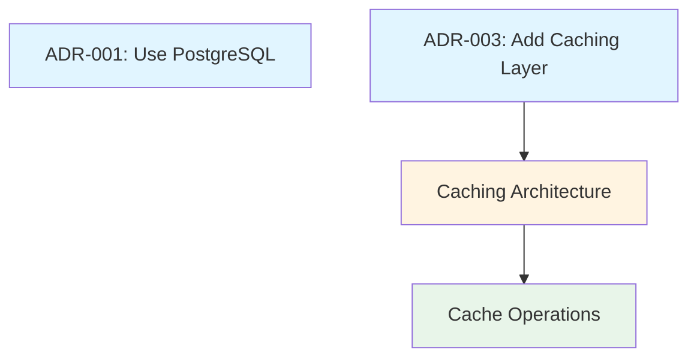

# fractary-docs Quick Start Guide

Get up and running with the fractary-docs plugin in 5 minutes.

## Installation

### 1. Clone Repository

```bash
git clone https://github.com/fractary/claude-plugins.git
cd claude-plugins/plugins/docs
```

### 2. Initialize Configuration

```bash
# Copy example config
mkdir -p .fractary/plugins/docs
cp config/config.example.json .fractary/plugins/docs/config.json

# Or initialize with command
/fractary-docs:init
```

### 3. Verify Installation

```bash
# List available commands
/fractary-docs:help

# Check sample documentation
ls samples/
```

## Your First Document

### Generate from Template

```bash
# Create an ADR
/fractary-docs:generate adr \
  --title "ADR-001: Use PostgreSQL" \
  --output docs/adrs/ADR-001.md

# Open and edit the file
vim docs/adrs/ADR-001.md
```

**Generated structure**:
```markdown
---
title: "ADR-001: Use PostgreSQL"
type: adr
date: "2025-01-15"
status: proposed
---

# ADR-001: Use PostgreSQL

## Status

**Proposed**

## Context

[Describe the context and problem...]

## Decision

[What was decided...]

## Consequences

[What are the implications...]
```

### Validate Your Document

```bash
# Run validation
/fractary-docs:validate docs/adrs/ADR-001.md

# Expected output:
# ✅ Front matter: valid
# ✅ Structure: all required sections present
# ✅ Links: no broken links
# ✅ Markdown: valid syntax
```

## Common Workflows

### Workflow 1: Create Documentation Set

For a new feature, create ADR → Design → Runbook:

```bash
# 1. Create ADR
/fractary-docs:generate adr \
  --title "ADR-003: Add Caching Layer" \
  --output docs/adrs/ADR-003-caching.md

# 2. Create design doc
/fractary-docs:generate design \
  --title "Caching Architecture" \
  --output docs/designs/caching-arch.md

# 3. Create runbook
/fractary-docs:generate runbook \
  --title "Cache Operations" \
  --output docs/runbooks/cache-ops.md

# 4. Link them together
/fractary-docs:link docs/adrs/ADR-003-caching.md docs/designs/caching-arch.md
/fractary-docs:link docs/designs/caching-arch.md docs/runbooks/cache-ops.md

# 5. Validate everything
/fractary-docs:validate docs/
```

### Workflow 2: Update Existing Docs

Update metadata and content:

```bash
# Update front matter status
/fractary-docs:update docs/adrs/ADR-003-caching.md \
  --field status \
  --value "accepted"

# Add tags
/fractary-docs:update docs/adrs/ADR-003-caching.md \
  --field tags \
  --value '["performance", "caching"]'

# Append to section
/fractary-docs:update docs/adrs/ADR-003-caching.md \
  --section "Consequences" \
  --content "### Performance Impact\n\nExpected 50% reduction in database load." \
  --mode append

# Validate changes
/fractary-docs:validate docs/adrs/ADR-003-caching.md
```

### Workflow 3: Generate Index

Create a browsable index:

```bash
# Generate by document type
/fractary-docs:create-index docs/ \
  --output docs/README.md \
  --title "Project Documentation"

# View the index
cat docs/README.md
```

**Result**:
```markdown
# Project Documentation

## Architecture Decision Records (ADRs)
- [ADR-001: Use PostgreSQL](./adrs/ADR-001.md) - *accepted*
- [ADR-003: Add Caching Layer](./adrs/ADR-003-caching.md) - *accepted*

## Design Documents
- [Caching Architecture](./designs/caching-arch.md) - *approved*

## Runbooks
- [Cache Operations](./runbooks/cache-ops.md) - *approved*
```

### Workflow 4: Visualize Relationships

Create a relationship graph:

```bash
# Generate Mermaid diagram
/fractary-docs:generate-graph docs/ \
  --output docs/GRAPH.md \
  --format mermaid

# View in Markdown viewer
cat docs/GRAPH.md
```

**Result**:


## Available Document Types

### Architecture Decision Records (ADR)

Document important architectural decisions:

```bash
/fractary-docs:generate adr --title "ADR-XXX: Decision" --output docs/adrs/
```

**Sections**: Status, Context, Decision, Consequences, Alternatives

**Use for**: Database choice, framework selection, design patterns

### Design Documents

Document system/feature designs:

```bash
/fractary-docs:generate design --title "Feature Design" --output docs/designs/
```

**Sections**: Overview, Architecture, Requirements, Implementation

**Use for**: System architecture, feature designs, technical specs

### Runbooks

Operational procedures:

```bash
/fractary-docs:generate runbook --title "Operations Guide" --output docs/runbooks/
```

**Sections**: Purpose, Prerequisites, Steps, Troubleshooting, Rollback

**Use for**: Deployment procedures, incident response, maintenance tasks

### API Specifications

API documentation:

```bash
/fractary-docs:generate api-spec --title "API Documentation" --output docs/api/
```

**Sections**: Overview, Authentication, Endpoints, Models, Errors

**Use for**: REST APIs, GraphQL schemas, RPC interfaces

### Other Types

- `test-report` - Test execution results
- `deployment` - Deployment records
- `changelog` - Version history
- `architecture` - System architecture
- `troubleshooting` - Debug guides
- `postmortem` - Incident reviews

See [Template Guide](../skills/doc-generator/docs/template-guide.md) for details.

## Configuration

### Basic Configuration

Edit `.fractary/plugins/docs/config.json`:

```json
{
  "output_paths": {
    "adrs": "docs/adrs",
    "designs": "docs/designs",
    "runbooks": "docs/runbooks"
  },
  "frontmatter": {
    "default_status": "draft",
    "default_author": "Engineering Team",
    "include_updated": true
  },
  "validation": {
    "enabled": true,
    "strict_mode": false
  },
  "linking": {
    "bidirectional_links": true,
    "auto_link_related": true
  }
}
```

### Common Settings

**Change default status**:
```json
{
  "frontmatter": {
    "default_status": "draft"  // or "proposed", "review", etc.
  }
}
```

**Enable strict validation**:
```json
{
  "validation": {
    "strict_mode": true,  // Warn on missing recommended fields
    "check_external_links": false  // Optional: check HTTP links
  }
}
```

**Customize output paths**:
```json
{
  "output_paths": {
    "adrs": "architecture/decisions",
    "designs": "architecture/designs",
    "runbooks": "operations/runbooks"
  }
}
```

## Commands Reference

### Generate Documents

```bash
/fractary-docs:generate <type> [options]

Options:
  --title <title>      Document title
  --output <path>      Output file path
  --author <name>      Document author
  --status <status>    Initial status
  --tags <tag,tag>     Comma-separated tags
```

### Update Documents

```bash
/fractary-docs:update <file> [options]

Options:
  --field <field>      Front matter field to update
  --value <value>      New value (JSON for arrays/objects)
  --section <name>     Section to modify
  --content <text>     New content
  --mode <mode>        Update mode: replace|append|prepend
  --backup             Create backup before update
```

### Validate Documents

```bash
/fractary-docs:validate <path> [options]

Options:
  --strict             Enable strict validation
  --check-external     Check external HTTP/HTTPS links
  --format <format>    Output format: text|json
```

### Link Documents

```bash
/fractary-docs:link <source> <target> [options]

Options:
  --one-way            Disable bidirectional linking
  --no-validate        Skip file existence check
```

### Check Links

```bash
/fractary-docs:link-check <directory> [options]

Options:
  --recursive          Scan subdirectories (default: true)
  --check-external     Check external URLs
  --fix-mode           Attempt to auto-fix broken links
```

### Create Index

```bash
/fractary-docs:create-index <directory> [options]

Options:
  --output <file>      Output file path
  --title <title>      Index title
  --group-by <method>  Grouping: type|tag|date|flat
```

### Generate Graph

```bash
/fractary-docs:generate-graph <directory> [options]

Options:
  --output <file>      Output file path
  --format <format>    Format: mermaid|dot|json
  --include-tags       Include tag relationships
```

## Tips & Best Practices

### 1. Start with Templates

Always use templates for consistency:
```bash
# Good: Use template
/fractary-docs:generate adr --title "..." --output ...

# Avoid: Creating from scratch
vim docs/adrs/new-adr.md
```

### 2. Validate Early and Often

Validate as you write:
```bash
# After creating
/fractary-docs:generate adr --title "..." --output docs/adrs/ADR-001.md
/fractary-docs:validate docs/adrs/ADR-001.md

# After editing
vim docs/adrs/ADR-001.md
/fractary-docs:validate docs/adrs/ADR-001.md
```

### 3. Link Related Documents

Create semantic relationships:
```bash
# ADR leads to Design
/fractary-docs:link adrs/ADR-001.md designs/implementation.md

# Design leads to Runbook
/fractary-docs:link designs/implementation.md runbooks/deployment.md
```

### 4. Keep Indexes Updated

Regenerate indexes after changes:
```bash
# After adding new docs
/fractary-docs:create-index docs/ --output docs/README.md

# Commit with changes
git add docs/
git commit -m "Add new documentation"
```

### 5. Use Tags for Discoverability

Add relevant tags:
```bash
/fractary-docs:update docs/adrs/ADR-001.md \
  --field tags \
  --value '["database", "postgresql", "infrastructure"]'
```

### 6. Regular Link Checking

Check links periodically:
```bash
# Weekly: Internal links only (fast)
/fractary-docs:link-check docs/

# Monthly: Include external links (slow)
/fractary-docs:link-check docs/ --check-external
```

## Troubleshooting

### Issue: "Template not found"

**Solution**: Verify template exists:
```bash
ls plugins/docs/skills/doc-generator/templates/
# Should show: adr.md.template, design.md.template, etc.
```

### Issue: "Validation failed: Missing required field"

**Solution**: Check front matter:
```bash
head -20 your-document.md
# Ensure has: title, type, date fields
```

### Issue: "Broken link detected"

**Solution**: Use relative paths:
```bash
# Good: Relative path
related: ["../adrs/ADR-001.md"]

# Bad: Absolute path
related: ["/docs/adrs/ADR-001.md"]
```

### Issue: "Command not found"

**Solution**: Verify plugin loaded:
```bash
# Check commands available
ls plugins/docs/commands/
# Should show: generate.md, update.md, validate.md, link.md
```

## Next Steps

**Learning Path**:
1. ✅ Complete this quick start
2. 📖 Read [Integration Testing Guide](./integration-testing.md)
3. 🎓 Study [Sample Documentation](../samples/)
4. 🔧 Review [Troubleshooting Guide](./troubleshooting.md)
5. 📚 Explore [Template Guide](../skills/doc-generator/docs/template-guide.md)

**Advanced Topics**:
- Custom templates
- CI/CD integration
- Codex integration
- Multi-project setups
- Custom validation rules

## Examples

### Example 1: Document a New Feature

```bash
# Step 1: Create decision record
/fractary-docs:generate adr \
  --title "ADR-010: Add Rate Limiting" \
  --output docs/adrs/ADR-010-rate-limiting.md

# Step 2: Update with decision
vim docs/adrs/ADR-010-rate-limiting.md
# [Edit content]

# Step 3: Mark as accepted
/fractary-docs:update docs/adrs/ADR-010-rate-limiting.md \
  --field status --value "accepted"

# Step 4: Create implementation design
/fractary-docs:generate design \
  --title "Rate Limiting Implementation" \
  --output docs/designs/rate-limiting.md

# Step 5: Link ADR to Design
/fractary-docs:link \
  docs/adrs/ADR-010-rate-limiting.md \
  docs/designs/rate-limiting.md

# Step 6: Validate
/fractary-docs:validate docs/

# Step 7: Update index
/fractary-docs:create-index docs/ --output docs/README.md
```

### Example 2: Maintain Documentation

```bash
# Weekly: Check links
/fractary-docs:link-check docs/

# Monthly: Full validation
/fractary-docs:validate docs/ --strict

# Quarterly: Update indexes and graphs
/fractary-docs:create-index docs/ --output docs/README.md
/fractary-docs:generate-graph docs/ --output docs/GRAPH.md

# Commit updates
git add docs/README.md docs/GRAPH.md
git commit -m "Update documentation index and graph"
```

## Support

- **Issues**: [GitHub Issues](https://github.com/fractary/claude-plugins/issues)
- **Documentation**: [Full README](../README.md)
- **Examples**: [Sample Documentation](../samples/)
- **Slack**: #fractary-docs channel

## Resources

- [Plugin README](../README.md) - Complete documentation
- [Integration Testing](./integration-testing.md) - Testing guide
- [Troubleshooting](./troubleshooting.md) - Common issues
- [Template Guide](../skills/doc-generator/docs/template-guide.md) - Template reference
- [Validation Rules](../skills/doc-validator/docs/validation-rules.md) - Validation details
- [Linking Conventions](../skills/doc-linker/docs/linking-conventions.md) - Linking best practices

---

**Ready to start?** Create your first document:

```bash
/fractary-docs:generate adr --title "Your First ADR" --output docs/adrs/ADR-001.md
```
